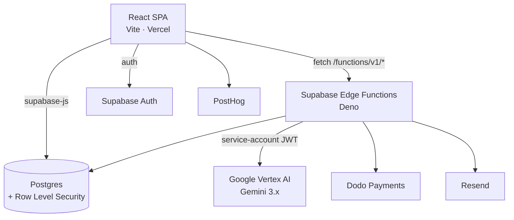

# JDMatchr

AI resume screening. Upload a job description and a stack of resumes, get back ranked candidates with match scores, strengths, concerns, and a fit breakdown — instead of reading a hundred CVs by hand.

**Live:** [jdmatchr.com](https://jdmatchr.com)

---

## What it does

1. **Describe the job.** Paste text, or upload the JD as a PDF or a screenshot. It gets parsed into a structured requirement set — required and preferred skills, responsibilities, qualifications, experience level.
2. **Upload resumes.** PDF, DOCX, images, or plain text. Each one is read into a structured candidate profile: contact details, experience, skills, education, certifications, projects.
3. **Get a ranked shortlist.** Every candidate is scored against the job and returned with:

   - a **match score** out of 100
   - a plain-language **summary**
   - **key strengths** and **potential concerns**
   - a **fit breakdown** across technical, experience, cultural, and growth-potential axes
   - a **recommendation**: `strong_hire`, `hire`, `maybe`, or `pass`

Reports are saved to your dashboard, and can be exported as PDF.

---

## Architecture

The frontend is a static SPA. All server work — file parsing, model calls, billing — happens in Supabase Edge Functions, so no API credentials ever reach the browser.



### Edge functions

**AI pipeline**

| Function | Input | Model |
| --- | --- | --- |
| `process-resume-text` | plain text | `gemini-3.6-flash` |
| `process-resume-pdf` | PDF (inline) | `gemini-3.6-flash` |
| `process-resume-image` | image (inline) | `gemini-3.6-flash` |
| `process-resume-docx` | DOCX | `gemini-3.6-flash` |
| `ai-candidate-matching` | job + candidate profiles | `gemini-3.6-flash` |
| `format-job-description` | plain text | `gemini-3.5-flash-lite` |
| `process-pdf-jd` | PDF (inline) | `gemini-3.5-flash-lite` |
| `process-image-jd` | image (inline) | `gemini-3.5-flash-lite` |

Two tiers, chosen deliberately. Candidate work runs on the stronger model because profile extraction sets the accuracy of everything downstream — a skill missed at parse time is invisible to the matcher. Job-description parsing is structured, lower stakes, and cheap for a user to re-run, so it runs on the lite model.

Both are reached through `supabase/functions/_shared/vertex.ts`, which handles auth and the request shape. Moving a function between tiers means swapping `MODEL_MAIN` for `MODEL_LITE` at the call site.

**Billing** — `create-dodo-payment`, `cancel-dodo-subscription`, `reactivate-dodo-subscription`, `retry-dodo-payment`, `dodo-webhook`, `generate-billing-pdf`, `generate-billing-report`

**Scheduled** — `process-expired-subscriptions` (daily, 02:00 UTC), `refresh-free-subscription-credits` (monthly on the 1st, 01:00 UTC). Both are configured as cron jobs in the Supabase dashboard, not in the repo.

**Other** — `generate-report-pdf`, `send-contact-email`, `delete-user-account`

### How Vertex auth works

Vertex authenticates with a service account, not an API key. The usual route to that — `google-auth-library` and Application Default Credentials — is Node-only and unavailable in Deno: there's no `gcloud`, no ADC file, no filesystem to read a key from.

So `_shared/vertex.ts` implements the OAuth2 flow directly. It signs a JWT assertion with Web Crypto (`RSASSA-PKCS1-v1_5` / SHA-256) and exchanges it at `oauth2.googleapis.com` for an access token, cached at module scope until 60s before expiry so an instance serving many requests doesn't re-mint per call.

Two things worth knowing if you touch this:

- **`GCP_LOCATION` defaults to `global`.** `gemini-3.6-flash` and `gemini-3.5-flash-lite` are not served in `us-central1` — they 404 there.
- **Vertex requires an explicit `role` on every `contents` entry.** The Gemini Developer API defaulted it silently; Vertex returns `400 Please use a valid role: user, model`. The shared client defaults it to `user`, so call sites don't have to.

---

## Tech stack

| | |
| --- | --- |
| Frontend | React 18, TypeScript, Vite 5 |
| UI | shadcn/ui (Radix primitives), Tailwind CSS, Lucide icons |
| State / data | TanStack Query, React Hook Form, Zod |
| Backend | Supabase — Postgres, Auth, Storage, Edge Functions (Deno) |
| AI | Google Vertex AI (Gemini 3.x) |
| Payments | Dodo Payments |
| Email | Resend |
| Analytics | PostHog |
| Hosting | Vercel |

---

## Getting started

**Prerequisites:** Node.js 18+, and the [Supabase CLI](https://supabase.com/docs/guides/cli) if you're working on edge functions.

```sh
git clone https://github.com/surya758/JDMatchr.git
cd JDMatchr
npm install
```

Create `.env.local` in the project root:

```sh
VITE_SUPABASE_URL=https://<your-project>.supabase.co
VITE_SUPABASE_ANON_KEY=<your-anon-key>

# PostHog analytics, read in src/main.tsx
VITE_PUBLIC_POSTHOG_KEY=<your-posthog-key>
VITE_PUBLIC_POSTHOG_HOST=https://app.posthog.com
```

Then:

```sh
npm run dev
```

> A `bun.lockb` is checked in alongside `package-lock.json`. Vercel builds with npm, so npm is the safer default if you're unsure.

### Scripts

| Command | Does |
| --- | --- |
| `npm run dev` | Vite dev server with HMR |
| `npm run build` | Type-check, then production build to `dist/` |
| `npm run build:dev` | Build in development mode |
| `npm run preview` | Serve the production build locally |
| `npm run lint` | ESLint |

---

## Edge function secrets

These are set on Supabase, never in `.env.local` — they must not reach the browser.

```sh
# Google Vertex AI
supabase secrets set GCP_SERVICE_ACCOUNT_JSON="$(jq -c . service-account.json)"
supabase secrets set GCP_LOCATION=global          # optional; "global" is the default
supabase secrets set GCP_PROJECT_ID=<project-id>  # optional; falls back to the SA document

# Dodo Payments
supabase secrets set DODO_API_KEY=<key>
supabase secrets set DODO_ENVIRONMENT=test_mode   # or live_mode
supabase secrets set DODO_PRODUCT_PRO_MONTHLY=<product-id>
supabase secrets set DODO_WEBHOOK_SECRET=<secret>

# Email
supabase secrets set RESEND_API_KEY=<key>
```

`jq -c` compacts the service account to a single line. Passing it multi-line via `"$(cat …)"` is where this usually goes wrong.

The service account needs `roles/aiplatform.user` on a project with the Vertex AI API enabled and billing active.

---

## Database

Postgres on Supabase, with Row Level Security throughout. Core tables:

| Table | Holds |
| --- | --- |
| `users` | Profile data, linked to Supabase Auth |
| `jobs` | Job descriptions and their parsed requirements |
| `candidates` | Uploaded resumes and their extracted profiles |
| `job_applications` | Candidate-to-job match results and scores |
| `subscriptions` | Plan, status, billing period, credit balance |
| `user_preferences` | Theme and per-user settings |

Migrations live in `supabase/migrations/` and apply in filename order:

```sh
supabase db push
```

---

## Deployment

**Frontend** deploys automatically from `main` via Vercel — config in `vercel.json`, with a catch-all rewrite to `index.html` for client-side routing.

**Edge functions deploy separately.** A git push does *not* ship them:

```sh
supabase functions deploy <function-name>
```

---

## Plans

| Plan | Price | |
| --- | --- | --- |
| Free | — | Credit-limited, refreshed monthly |
| Pro | $14.99/mo | Higher credit allowance |
| Enterprise | Coming soon | |

Credits are consumed per analysis and tracked on the `subscriptions` table.

---

## Project structure

```
src/
  components/
    dashboard/       Dashboard shell, reports, settings, billing
    ui/              shadcn/ui primitives
  hooks/             Auth, subscription, resume + JD processing, analytics
  lib/               Supabase client, AI matching, utilities
  pages/             Routed pages
  types/             Shared TypeScript types

supabase/
  functions/
    _shared/         Vertex AI client shared by every AI function
    <function>/      One directory per edge function
  migrations/        Ordered SQL migrations
```
